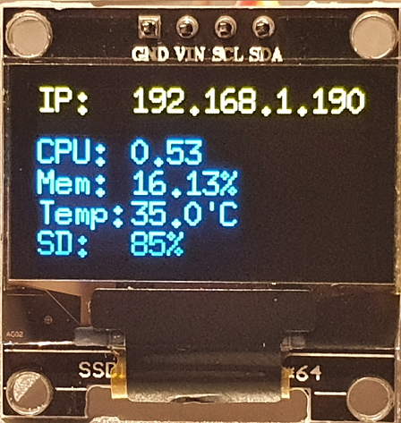

# PiStats

Sample go-app for displaying stats on [Monochrome 0.96" 128x64 OLED graphic display (SSD1306)](https://www.adafruit.com/product/326) with a raspberry-pi.

## Output:

## Todo:
- Add support for external/usb-drive